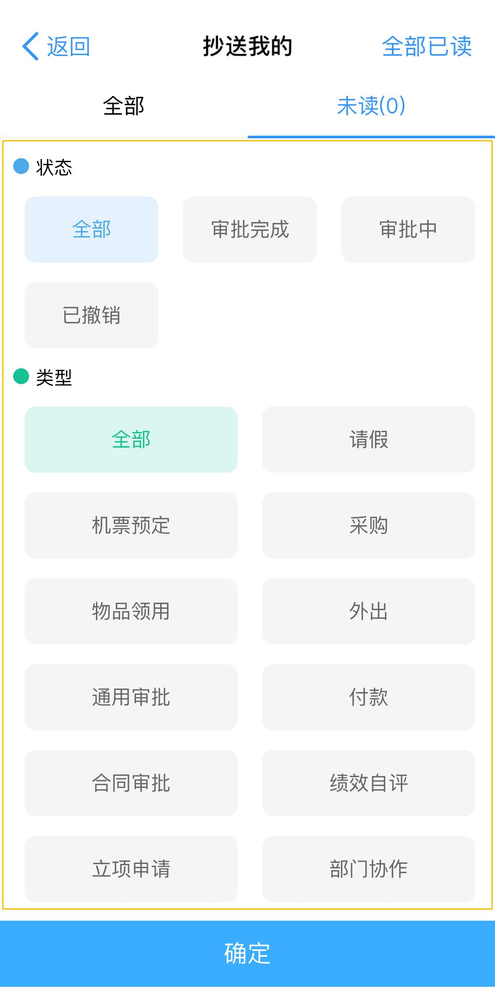

# 移动端多数据视图

移动端多数据视图，在 app 中作为多项数据列表方式展示内容，是 app 中最常见的数据载体之一。在应用中使用它是，

本文将详细讲解多数据视图结构注册和行为逻辑，希望给开发人员理解 iBiz 前端模型中的移动端多数据视图模型一些的思考与启迪。

## 结构组成

本章节主要以常见的多数据视图为例，做视图结构组成介绍。

基于应用功能的不同，视图一般由多个部分组成。常见的有标题、操作和数据，如下图所划分的区域所示：

图 1 

在图 1 中，区域 1 属于视图标题，区域 2 属于视图操作区域，区域 3 是多数据视图数据过滤区，区域 4 属于多数据区域。

功能区域的划分，从视图结构组成来说，是为了复用某些公共内容，避免重复添加相似的内容到同一个应用的视图之中，需求发生变更后，不断重复的修改内容。同时，功能区域也是业务设计能力的表现，恰当的业务设计，会避免很多功能内容重复开发。

iBiz 前端模型中，将公共的业务数据对象封装成部件，提供模型化构建部件能力，通过发布引擎，动态发布基于业务能力的部件内容。因此，在  iBiz 中，部件内容是特殊的，通过构建部件业务模型发布部件内容的过程是一致的。

对于视图的构成，出了部件之外，还有直接视图模型，以下我们将视图内容模型化详细介绍。

### 视图标题

在图 1 中，区域 1 是直接视图模型发布内容，在多数据视图中，也是静态内容。

视图标题，一般可以由文字和图标构成。文字用于简述视图业务名称，图标对视图名称做补充说明。例如，一个多数据视图用于展示计算机库存数据，在视图标题上包含一个计算机图标，能跟恰当的表达该视图的业务功能。

同时，视图标题还允许使用视图样式模型修改文字样式，为非代码开发人员提供视图内容调整能力。

> 注：静态内容，一般在模型中构建发布完成后，在 app 的运行过程，展示的内容不会变化。

### 工具栏部件

区域 2，在 iBiz 模型中，被称之为工具栏。

视图内容中，操作区域集中管理，方便 app 使用人员从视图界面中寻找操作接入点。界面的内容组织上，将操作点胡乱布局，而也不利于界面内容的展示。

工具栏一般由对视图的操作行为构成，如新建数据、打开某个视图等针对视图的操作行为。同时，工具栏还是视图逻辑触发起点，界面逻辑交互的入口。

### 搜索栏

对于多数据视图，数据一般使用列表展示，在大量的列表数据中过滤用户所需数据，是必须具备的功能。

过滤一般分为两种，即搜索栏分为快速搜索和自定义搜索。

#### 快速搜索

快速搜索，一般以多项数据中的数据属性值与过滤条件有包含关系，即返回对应数据。

图 1 的区域 3，即为快速搜索的示例，搜索效果如下图：

图 2 

在图 2 所示中，数据包含关键字`文件`的数据，都将作为满足的条件的数据返回。

#### 条件搜索

条件搜索，是用户选择搜索条件过滤多项数据，返回满足条件的数据。

图 3 

图 3 是一个抄送消息的多数据视图，区域 1 是快速搜索，区域 2 是条件搜索，展开搜索条件如下：

图 4 

图 4 搜索条件有两个，分别是状态和类型，用户可以选择需要搜索条件，点击确定后，使用该条件加载在数据，条件如下：

图 5 

在图 5 中，用户选择了状态为审批完成、类型为请假作为搜索条件。

图 3、图 4 和图 5 一起展示了在多项数据中条件搜索的方式，其中，图 4 内容，其业务模型化，在 iBiz 中被称之为搜索表单，它与工具栏都是业务模型部件之一，详情见搜索表单章节。

### 搜索表单部件

搜索表单，其功能用于过滤多项数据。

在常见的多项数据视图中，一般的数据搜索不能满足某些特定的查询要求，例如指定某些条件等。因此，iBiz 将搜索分为快速搜索和条件搜索，图 4 所示功能，即为条件所示，内容是搜索表单模型。

开发人员可以通过配置查询条件中状态与类型的选择数据条件，来为多项数据视图数据查询作为筛选条件，提供更多的过滤选择。

作为过条件搜索对象，为了细化前端处理能力，建议将部分过滤条件处理逻辑前置在前端，这样可以明显的减小前后端交互数据压力。

### 多项数据部件

多项数据部件，是多项数据视图的核心组成。

在多项数据视图中，该部件提供数据加载、数据删除和查看详情等，图 1 中，区域 4 属于多项数据部件。由于移动端界面大小的原因，部件内数据展示的信息，一般多为主要的基本信息，例如标题、时间等。

该类部件数据加载，进入部件有一次初始化加载，同时部件还提供下拉加载的功能。此外，该部件的每行数据支持左滑、右滑的处理逻辑。

多数据部件作为多数据视图的核心，其视图布局和功能逻辑，基本围绕多数据部件展开，为多数据部件提供更多的能力。

## 行为逻辑

视图行为逻辑，是视图所有交互的实际表现。在视图中，将行为分为视图行为和部件行为。

### 视图行为

在图 1 中，区域 2 内属于行为，该区域触发的界面展示如下所示：

图 6 
 
触发行为区域内的 `密` 字图标，即打开图 6 所示内容。

图 7 
 
触发行为区域内的电话图标，即打开图 7 所示内容。

图 8 
 
触发行为区域内的加号图标，即打开图 8 所示内容。

图 6、图 7 和图 8 三个示例中，每一个的行为操作都有对应的界面展开，就多数据视图而言，只是作为其他界面操作的入口，本身不对多数据视图产生影响。

该行为触发对应的功能逻辑展现不同界面后，视图本身不在关注该行为触发后本身的结果。

### 部件行为

